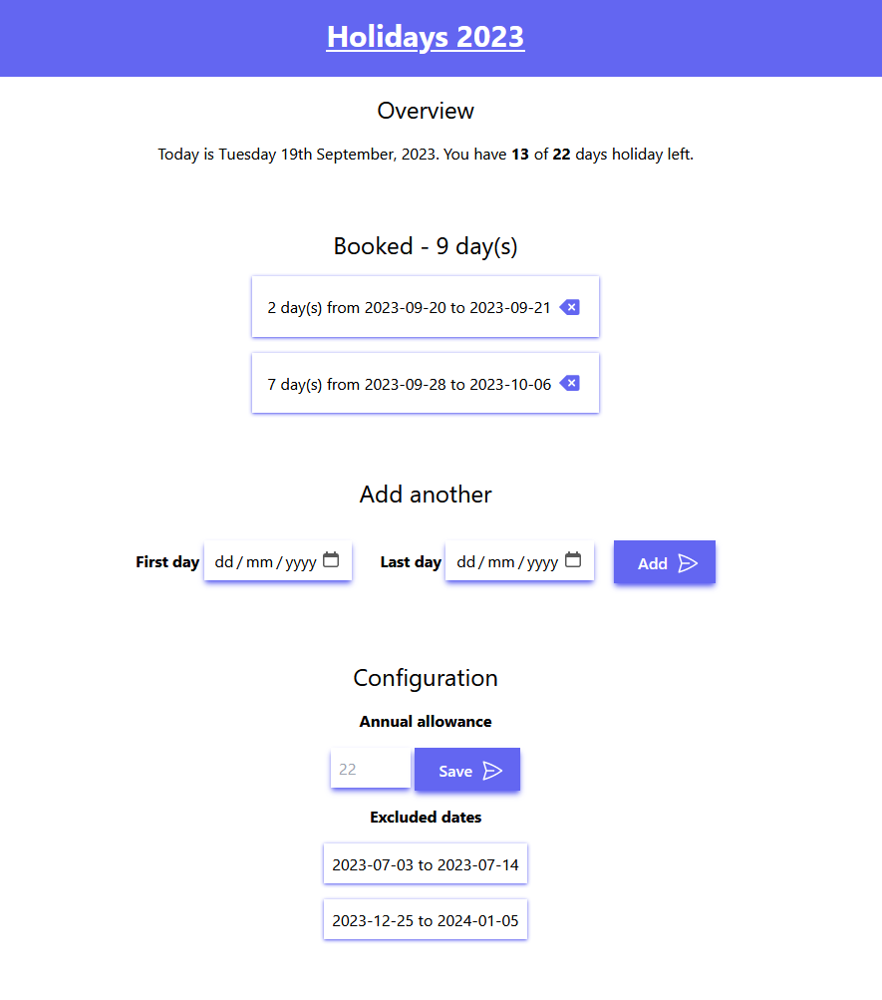

# holiday tracker

## Description

A holiday tracker app created using Svelte, SvelteKit and TailwindCSS. Designed only for personal use as it doesn't have user account functionality; stores all data in an SQLite db.

Allows you to:

* View and set your annual holiday allowance total
* Add and delete holidays which are calculated against business days
* See your remaining holiday allowance
* Set (manually in the db at the moment) excluded holiday periods which cannot be booked against
* Prevent various error scenarios such as tracking more holiday than your allowance, booking holidays which start before they end, booking holidays which overlap etc.

## Improvements/features/stretch goals

* Increase test coverage now that functionality has stabilised
* Allow user configuration of excluded date ranges
* Link to download to your calendar? 🤔
* Multi-user functionality
* Split configuration to a different page

## Install and run

* Initialise the db with `npm run dbinit`
* Build with `npm run build`
* Or dev with `npm run dev`

## Attributions

* [Svelte](https://svelte.dev/)
* [SvelteKit](https://kit.svelte.dev/)
* [TailwindCSS](https://tailwindcss.com/)
* [Heroicons](https://heroicons.com/)
* [date-fns](https://date-fns.org/)